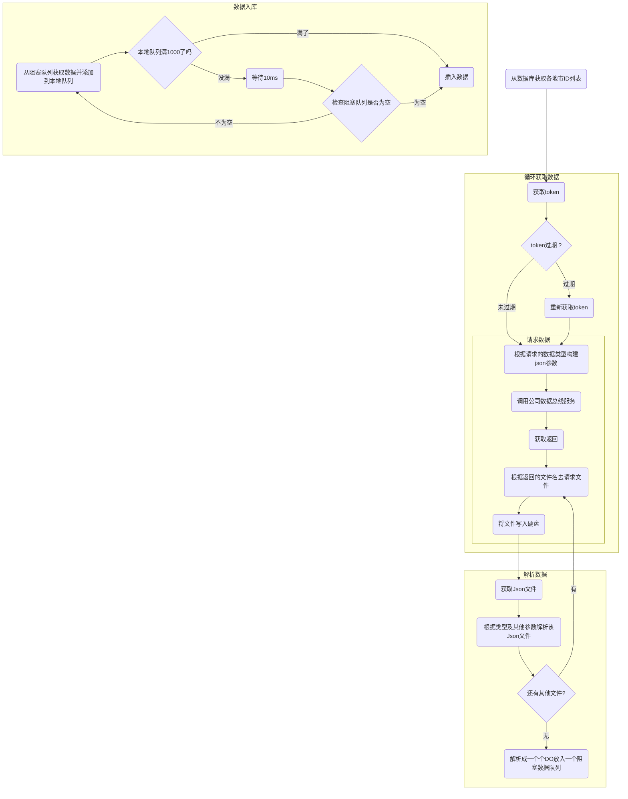

# 记录一次OOM的排查经历（远古）

## 项目背景

这是一个老项目了，也是中途接手的，因为以前开发的程序员好像走了，然后项目接近验收了，所以转给了我的小组长。应该是ssm的项目，有点久远了，记得不是很清楚，主要要说的是里面的一个数据同步的模块。这里的定时数据同步模块是基于quartz做的，最开始task比较少，没什么问题，然后接手之后，又多了许多需要同步的数据.

这里主要的请求过程之类的是我的组长开发的，到具体需要接那些数据之类的，就是我来了。他开发完认证，请求，解析，入库这些部分之后，就交给我做剩下的脏活累活。之后他调去开发另外一个大的项目之后，我就基本处于放养的状态了，什么都是自己上手。

这个web项目呢需要部署在两台服务器上，就叫A和B吧，为了避免数据的重复呢，就是部署完A之后，改一下定时任务的配置，再部署在B上面（远古项目+技术必较落后的公司，应该是19年还是20年的事情了）。

以下是这个数据模块执行的大致流程：

## 问题

### 第一次出问题

随着需要同步的数据越来越多，直到某一天，项目经理和我说，你看看A服务器上的服务是不是出问题了啊，怎么没有反应了，B服务器上面的是好的。我用浏览器访问A服务器的web服务，发现确实没有响应了。当时看了一下free和top，发现内存占用不高，CPU占用率也不高。

于是去查看tomcat的日志，发现也没有什么问题。当时不知道是什么问题，所以就先把tomcat给kill了，重新启动了一下，A服务恢复了正常。之后观察了一下，发现没什么问题，就以为是什么偶发的问题，就没管了。直到下一个月的二号。

这天项目经理又和我说A服务器没反应了，情况还是和上次一样，我重启之后想到了上次出问题也是在二号，立马想到了之前新增加的月数据同步任务。于是将这个月任务的时间调整了一下，并告知项目经理我的猜测。

之后项目经理要求我将这个数据同步模块摘出来，就算其出了问题也不要影响Web服务。随后将其拆成一个jar包，原web服务还是保留了这些Job，方便补数据。

### 第二次出问题

之后相安无事了好久，终于又出问题了，项目经理找我说怎么有一天的某个地市的数据漏了，于是我去看了看日志，发现日志里一直在打印“文件尚未下载完毕，继续下载……”，遂去代码里查询，发现之前组长判断文件是否下完不仅仅是根据文件流读完了没，而是根据文件流是否读完且文件大小是否大于1024b（？）。

当这个json文件的data项为空时，就出问题了，它会一直去请求文件，这个线程就hang在这里了。

于是我就去观察了一下最近的一些json文件，发现如果文件过大的话，服务提供方会在json中增加一个new_file项，根据这个去请求新的文件就行了，便去掉了对于文件大小的检测。

### 第三次出问题

这次又是数据没有入库，去看了一下日志，发现线程在打印读取xx文件后就没反应了，我拿了一个大的json文件在本地测试了一下，发现读取需要挺多时间（用的好像是net-slf还是什么的json包），我心想也许是一次性读取大的json文件导致的吧（当时没有想到其实有多方因素），于是选择将json文件的读取以及解析改为流式的，不一次性加载进内存。

### 第四次出问题

又是一段时间过去，服务挂掉了，我查看了一下日志，发现OOM了，其实不用什么内存分析工具我大概也知道是哪里出的问题，那个阻塞队列里的数据消费的太慢了，一个job的数据还没完全入库，另外的job的数据又进来了，并且这里解析数据都是新建一个线程去处理的，就是new Thread的形式，这样在一段时间内会导致线程数激增，并且切换线程的成本又高，导致消费数据的线程工作时间变少。恶性循环导致数据越堆越多，然后GC又要stw，却也回收不了内存空间，最后导致了OOM。

这一段的改造主要就是将解析数据的new Thread全都放到线程池中去处理，coreSize = 4，maxmumPoolSize = 8的一个线程池，根据11个地市设置了30的有界队列，拒绝策略为自定义的一个拒绝策略，将被拒绝的任务参数写到数据库里，之后人工手动补一下。

然后将处理数据入库的线程设置为三个，充分利用CPU。

最后做的一件事就是修改了这个程序的Xmx和Xms，并且调整了年轻代和老年代的比例，因为这个数据同步应用的性质就是获取数据并且插入数据库，说明大部分对象其实都是朝生夕死的，这很符合年轻代对象的特征。这样能在一次YoungGC到下一次的间隙中尽可能将数据入库，这样在YoungGC时可以使更少甚至没有数据对象晋升至幸存者区或者老年代。减少OldGC或者FullGC的可能。

## 重构

处理完所有问题，之后遇上国家电网服务改造，所有服务能上云的全都要上云，都要容器化，索性我就趁这个机会，把这个数据同步模块给彻底重构了。

首先就是从Spring+Mybatis+Quartz的架构（甚至没有Maven）改成了Springboot，然后去掉了quartz，使用Springboot自带的scheduler进行调度，然后根据Job建了一张表，任务的名字，执行时间，任务类型之类的全部放入数据库。

然后参考AQS的思想（模板模式），所有的调度任务都要实现一个我自定义的BaseJob接口，BaseJob接口则继承了Runnable接口，对run方法进行了default实现，打印一些参数，插入日志以及校验任务是否禁用等，然后也default了日期参数之类的东西。真正的各自任务执行逻辑放在了execute方法中，每个Job类都需要实现自己的任务逻辑。

这样在应用启动之后，会将数据库中所有非禁用的任务查出，从Spring的容器中获取对应的job-bean，并交给springboot的任务调度器进行任务调度。

然后留了几个接口用于处理任务的调用，禁用以及数据的补录等。
