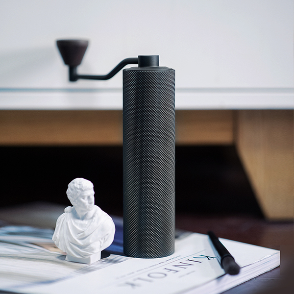
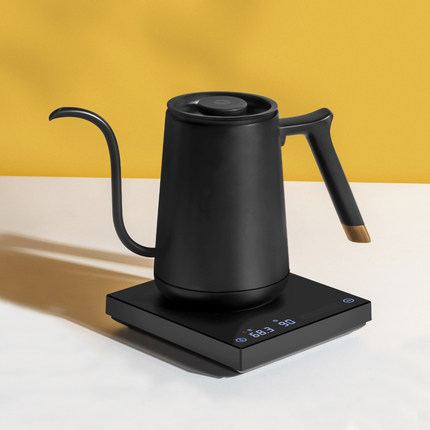

# 如何在家自制一杯咖啡？
<!-- vim-markdown-toc Marked -->

* [准备工作](#准备工作)
  * [原材料](#原材料)
    * [咖啡豆](#咖啡豆)
      * [产地](#产地)
      * [处理法](#处理法)
        * [日晒](#日晒)
        * [水洗法](#水洗法)
      * [其他](#其他)
        * [风味](#风味)
        * [单品和拼配](#单品和拼配)
  * [工具](#工具)
    * [分享杯](#分享杯)
    * [滤杯](#滤杯)
    * [滤纸](#滤纸)
    * [手磨/电磨](#手磨/电磨)
    * [水壶](#水壶)
    * [电子称](#电子称)
* [制作流程](#制作流程)
  * [研磨豆子](#研磨豆子)
  * [烧水](#烧水)
  * [浸润滤纸](#浸润滤纸)
  * [冲泡咖啡](#冲泡咖啡)
    * [闷蒸](#闷蒸)
    * [冲泡](#冲泡)
    * [移液](#移液)

<!-- vim-markdown-toc -->
## 准备工作

### 原材料

#### 咖啡豆

既然要冲泡咖啡，那么作为主角的咖啡豆当然是必不可少的。咖啡豆的挑选其实是非常私人的东西，有些人比较喜欢喝酸的，烘焙度比较浅的咖啡，而有些人就会比较喜欢喝苦的，烘焙度比较深的咖啡。

所以多喝，多试，总是能找到自己喜欢的口味的。以下列举的呢，就是一些比较普罗大众的分类，也是最基础的分类。可以从这些基础的品类中先筛选自己比较偏向的那一类，然后再进行深入的了解。

##### 产地

这里我就讲讲我自己喝过的，哥伦比亚，埃塞俄比亚，还有云南，其实体感上来说，不说风味，光从豆子的品质上来讲，相同价格的情况下，其实云南的豆子应该是要好一些的，不过我看云南好像也没有出什么特别高端的豆子。

总的来说就是，相同价格的相同品质的情况下，云南咖啡的单价一般是其他产地的二分之一的水平，所以以后大家如果真的有喝咖啡的习惯的话，建议大家多多支持国产。

##### 处理法

处理法，其实就是咖啡风味的主要来源。处理法有很多，但是我目前只接触过日晒和水洗的咖啡豆，然后喝过木桶发酵处理的咖啡。这种风味的差距其实还是非常明显的。

但是处理法我个人还是知之甚少的，这一块我就简要地讲一下。大家如果之后有需要的话，可以自己去找资料看看，我就起个领进门的作用。

###### 日晒

日晒的咖啡豆，顾名思义就是用太阳晒。

不过现在纯的日晒应该已经很少了，纯日晒的意思就是，从果实摘下来的那一刻起，就不经过任何处理，直接在太阳底下晒，所以这种处理法会要求农场所在地的气候干燥，当然现在大家会用烘干机加速干燥这个过程，并且容易控制干燥程度。

比起纯日晒，日晒处理法现在更多的应该是指半日晒的形式，半日晒指的是，经过一系列前置处理过程（这个部分会在水洗法中提及）之后才开始日晒的过程，最后再抛光除去残留的果肉，再出售。

###### 水洗法

水洗法的主要流程就是，先将采集的果实放入水槽中浸泡。浸泡一段时间之后，成熟的果实就会沉到水底，而尚未成熟的果实会浮在手上，此时可以加以剔除。

然后使用专用的机器，将果肉与咖啡豆分离，经过这个处理过程之后的咖啡豆外面就只剩一层包裹着的黏膜。

然后放置进行发酵，发酵的过程中黏膜也会开始分解，这个阶段是水洗法对咖啡豆风味影响最大的一个阶段（其实主要就是发酵），这个阶段会持续18~36小时。

再之后就是水洗，利用水流和豆子之间的摩擦，彻底将已经干裂的黏膜洗掉。之后的处理方法其实和日晒法就没有什么太大的差别了。

其他的处理法我就不太了解了，有兴趣的大家可以自己去查阅相关资料。

##### 其他

###### 风味

咖啡的风味呢，一直都是一个比较见人见智的事情，因为从我自身来说，我喝过这么多不同的咖啡豆，我也只能勉强喝出一些咖啡豆的新旧以及品质好坏。而至于风味，不把两种不同的咖啡豆同时都比着喝我也很难喝出来。而至于更深层次的那种，柑橘啊，佛手瓜，红酒之类的风味，只能说，看着袋子上的风味提示，还是勉强能品出来一点点的，这个可能需要长时间的训练。

###### 单品和拼配

单品的意思就是同一种咖啡豆，拼配则是许多不同种的咖啡豆混合在一起的喝法。拼配是一门非常高深的学问，要对不同的咖啡豆的特性和风味有很深的了解，才能取长补短，得到自己想要的风味。我个人平时都是喝单品的，我唯一会喝拼配的时候就是一些老的豆子剩的不多了就直接混混一起喝了。

### 工具

#### 分享杯

分享杯这个是一个很随意的东西，你可以用任意容器来装你泡出来的咖啡液。

比如说你只有自己喝的话，你可以直接把自己的杯子当分享杯。不过我个人推荐还是用实验室的烧杯，一它比较耐热，二来它有刻度，方便掌控浓度。

容积在100~200ml的分享杯就比较适合一个人用，300~500ml就基本可以满足两到三个人的需求了。当然这也需要你的滤杯能够支持这么多的咖啡粉。

#### 滤杯

滤杯最好是买和分享杯同个水平的，滤杯一是决定了你一次性可以对多少的咖啡粉进行萃取，二是决定了你的水量。

#### 滤纸

最好买原木的纸，漂白的那种冲出来的咖啡有一种奇怪的味道。然后就是买和你滤杯同尺寸的纸张就好了，所以滤纸和滤杯最好在同一家买配套的，或者你自己了解尺寸去买也可以。

#### 手磨/电磨

咖啡豆的磨粗分有两种，手动的和电动的，自己在家里玩玩的话我推荐买手动的就行了。当然如果你今天听了我的介绍心血来潮想开一家咖啡店的话，那么买一台电动的也并无不可。当然我自己并没有用过电动的，在这里我就和大家说一说手磨的选择。

第一个重点，别买太便宜的，两百元以下的磨我并不建议买，磨出来粉的均匀程度会让你想死。

最佳的自用的价位，大概在600元上下，在600的这个价格，你去买手磨，当然提前先做一点功课的情况下，你是不会买到垃圾的。
比如泰摩的栗子slim，最近双十一活动价600-，还是个不错的选择

在这里我会推荐我自用的这一款，300元的价位，600元的品质，唯一的缺点就是要等很久。如果你愿意等的话，那我手上的玲珑是一个很不错的选择。

#### 水壶

热水壶这种东西我相信大家家里都是有的，那其实用来冲泡咖啡的壶呢和一般的热水壶又会有一点区别。一般的热水壶的壶嘴比较粗，冲咖啡的时候会要求你的水流大小可控，所以冲咖啡的壶一般壶嘴又长又弯又尖。也有两者结合的冲烧一体的，这个价格可能会更贵一点，再加上智能控温的功能的话，价格就直接起飞了。但是没有智能控温系统的话你就需要自己准备一根温度计，插入壶嘴中，等温度到自己想要的温度时再开始冲泡。

我现在自己用的是，泰摩的鱼壶，冲烧一体，带智能控温系统，水流稳定且有限流阀，还是蛮好用的。

#### 电子称

这个东西是让你来控制一次要磨多少粉，以及冲出多少咖啡液的。因为虽然你的磨的容积是一定的，但是咖啡豆因为种类不同的关系，体积会不一样，所以同样能装下的咖啡豆的重量其实是不同的。咖啡液的话，其实用带刻度的烧杯可以解决量的问题。

## 制作流程

接下来我就边做边说了，文字描述我就稍微省略一点。

### 研磨豆子

这一步最重要的其实就是选择磨多少豆子，我个人推荐一人份的话，一次15g的咖啡豆就ok了，不要太多，一天最好不要摄入超过40g的咖啡豆，咖啡因太多也是会中毒的。

其次就是咖啡豆的研磨程度，其实这个是可以通过磨来设置的，一般的手磨都会有一个刻度盘，扭动刻度盘就能决定研磨完的咖啡豆的颗粒度，手冲最适宜的颗粒度就是粗白糖的大小。

### 烧水

烧水的一个要点就是水的温度，水温对咖啡风味的影响也是比较大的，一般来说，水温较高的时候，冲泡出来的咖啡会带有明显的焦香，并且苦味会比较明显，然后酸味会被抑制，而较低水温冲出来的咖啡则相反，但是这个差别其实也并不是特别明显。我一般都是用93摄氏度的水来冲的。一般来说你买的咖啡豆的袋子上会写推荐多少度的水温。大家可以都试试，选择自己比较喜欢的温度就可以了。

### 浸润滤纸

浸润滤纸这一步并不是必须的，很多日式咖啡在冲泡的时候并不会预先浸润滤纸。

浸润滤纸在我看来有两个用处，一个是在润湿滤纸的同时会将滤杯的温度也提升上去，避免温差的问题导致风味有差异。另外一点就是提前润湿滤纸，这样不会导致咖啡液被滤纸吸走。

### 冲泡咖啡

#### 闷蒸

闷蒸一是为了在正式的冲泡开始之前能对咖啡粉有一个预先浸润的作用，类似一个warmup的概念。并且先适当排出豆子中的气体（主要还是二氧化碳）。这样在咖啡粉隆起之后，颗粒之间的空隙就会增大，就能更好地萃取。

#### 冲泡

冲泡有很多种手法，我个人感觉其实就一个要点，手要稳，水流不能忽大忽小，不然容易萃取不均匀，当然一个好的带限流阀的水壶能让你的工作轻松一点。还有就是针对比较老旧的豆子，一定要用大水流冲煮，让粉和水充分接触，不然就会一嘴木屑的味道。

#### 移液

这个可做可不做，一般来说最后一段的咖啡液，一是风味不是很明显，简单来说就是淡了，但是淡了其实没什么关系，重要的其实是————二，最后一段的咖啡液一般有比较复杂的不好的风味，例如木屑味，涩味都会很明显。所以一部分人会选择将最后一段的咖啡液移掉，用热水添到自己想要的水粉比，还有一部分责任为这个也是咖啡风味的一部分，也应当保留。这个就看大家个人的选择了。

好了，今天有关咖啡的分享就到此结束了，谢谢！
