# 从ReentrantLock来看AQS(基于openjdk17)

## 准备工作

### 代码

首先在随便一个类的main方法中输入这样一段代码

然后在如图所示的地方打上断点


代码如下：

``` java
  public static void main(String[] args) throws Exception {
    Lock lock = new ReentrantLock();
    new Thread(() -> lock(lock)).start();
    new Thread(() -> lock(lock)).start();
    new Thread(() -> lock(lock)).start();
  }

  private static void lock(Lock lock) {
    try {
      lock.lock();
      System.out.println(Thread.currentThread().getName() + " get the lock");
    } finally {
      lock.unlock();
      System.out.println(Thread.currentThread().getName() + " release the lock");
    }
  }
```

### maven设置

打开idea的设置，搜索maven，在importing栏将红圈处设置成如下所示，这样方便浏览源码以及注释

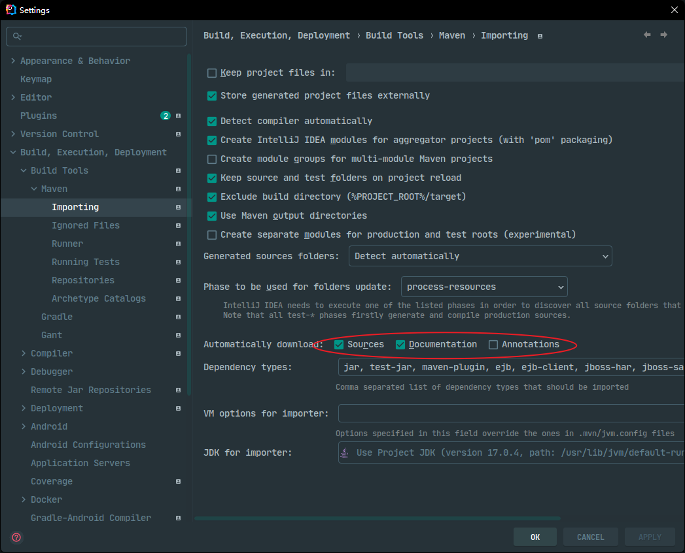

## 加锁以及入队

右键开始debug


此处记得所有的断点应为Thread模式，右键断点即可设置

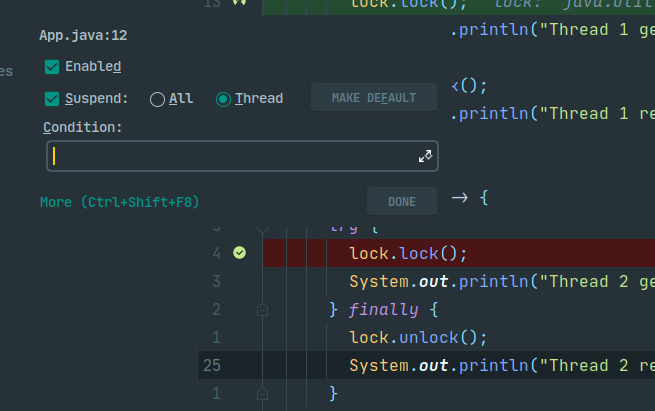

此时我们可以清晰看到所有的线程均已停在lock.lock处


### Thread-0

接下来我们选择Thread0开始加锁，看看在没有竞争的情况下获取锁的流程，点击force step into，来到了ReentrantLock的lock方法

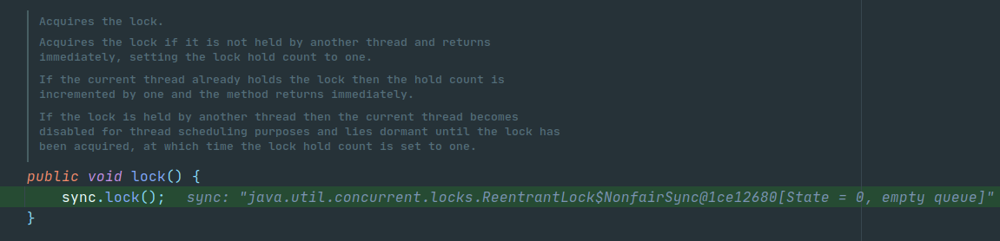

可以看到此时的同步器是非公平的，这也是ReentrantLock默认的同步器

Sync是ReentrantLock的一个内部类，它继承了AQS，然后ReentrantLock在自己内部实现了两个Sync的子类（也就是公平和非公平）

ReentrantLock中基本所有的方法都是由Sync去实现的

在剔除一些类后，它们的关系是这样的

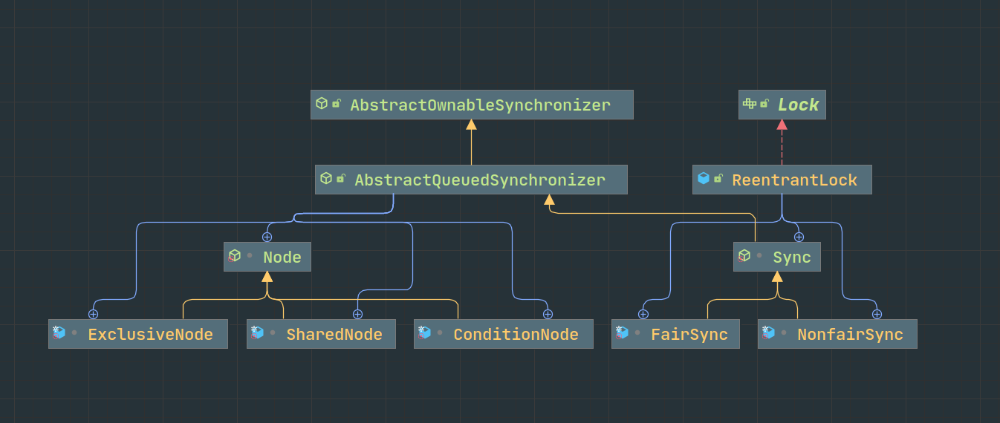

其实可以看到AQS中的Node从老版本的final Class变为了现在的abstract Class，并且多了三个子类，之后我们就可以看到这和改版之前的AQS到底有什么区别

再次下一步，来到Sync的lock方法

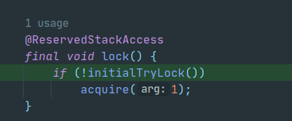

直接进入initialTryLock()方法，由于我们是默认的非公平锁，所以此时来到了NonfairSync实现的initialTryLock方法中

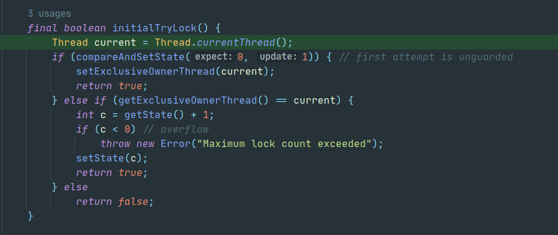

这里的方法好像都是包装了unsafe中的native方法，大概都是这个样子的

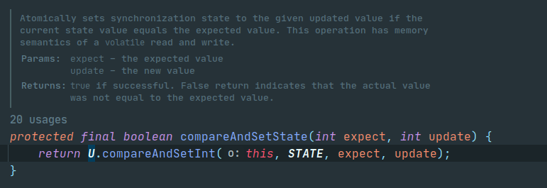

所以我就不一个个点进去看了，会在下方用中文写上注释

```java
final boolean initialTryLock() {
  //获取当前正在运行的线程
  Thread current = Thread.currentThread();
  //调用AQS的CAS方法，尝试将state从0改为1
  //第一种情况
  //成功后将独占线程设为当前线程，返回加锁成功
  //第二种情况
  //CAS失败后，检查这个锁的占有线程是否为当前线程
  //若是，则重入，此处做了一个校验
  //如果重入次数过多，超出了int上限（溢出变为负数）
  //则抛出一个错误
  //第三种情况
  //既CAS失败，自己也不是锁的持有者，失败
  if (compareAndSetState(0, 1)){
    setExclusiveOwnerThread(current);
    return true;
  } else if (getExclusiveOwnerThread() == current) {
    int c = getState() + 1;
    if (c < 0)
      throw new Error("Maximum lock cound exceeded");
    setState(c);
    return true;
  } else
    return false;
}
```

由于我们现在没有竞争，所以走的是第一种情况，返回true后取反，显然不会进入if下的方法体


再返回，回到我们的main方法中来，可以看到lock的情况是locked by thread Thread-0

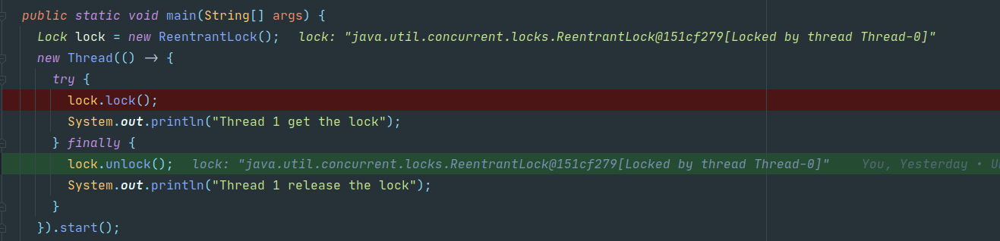

所以在这里时，我们三个线程和锁的状态是这样的，Thread-0已经成功上锁，将state设置为1，且独占线程设置为自己，此时因为直接抢占成功，而剩余两个线程尚未尝试上锁，所以head和tail都是null，CLH队列处于尚未初始化状态。


### Thread-1

接下来我们切换到第二个Thread，看看加锁失败的流程，选择我们的第二个Thread，也就是Thread-1

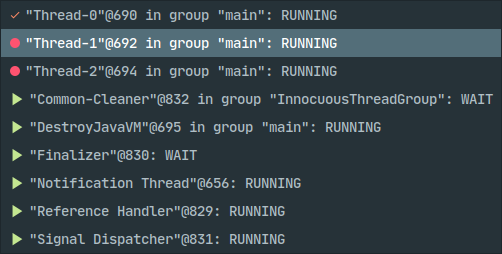

省略调前面相同的步骤，再次来到initialTryLock，显然走的是第三种情况

```java
final boolean initialTryLock() {
  //获取当前正在运行的线程
  Thread current = Thread.currentThread();
  //调用AQS的CAS方法，尝试将state从0改为1
  //第一种情况
  //成功后将独占线程设为当前线程，返回加锁成功
  //第二种情况
  //CAS失败后，检查这个锁的占有线程是否为当前线程
  //若是，则重入，此处做了一个校验
  //如果重入次数过多，超出了int上限（溢出变为负数）
  //则抛出一个错误
  //第三种情况
  //既CAS成功，自己也不是锁的持有者，失败
  if (compareAndSetState(0, 1)){
    setExclusiveOwnerThread(current);
    return true;
  } else if (getExclusiveOwnerThread() == current) {
    int c = getState() + 1;
    if (c < 0)
      throw new Error("Maximum lock cound exceeded");
    setState(c);
    return true;
  } else
    return false;
}
```

回到Sync的lock，此时我们是false，取反即为true，所以进入if方法体中的acquire方法，来到了AQS的acquire方法中

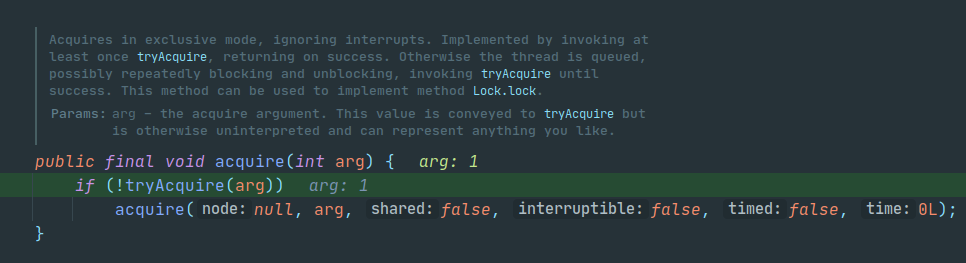

step into这个if判断的trayAcquire方法中，我们看一下这个方法

由于此时我们的T1（thread-0）正持有这把锁，所以这里显然也会失败，再次返回false

这里try一下的原因是有可能第二个线程进来的时候可能第一个线程已经完事了，这样我们可以直接上锁，不用进入等待队列了

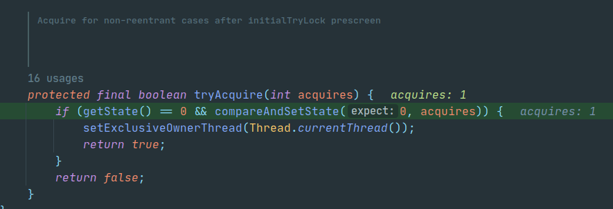

回到acquire方法，此时返回结果是false，取反后为true，进入方法体中的acquire

这个是主要的acquire方法，会被所有暴露的其他acquire方法调用

也是逻辑最复杂的地方，这里走明白了，基本上AQS也就全OK了

这里的变动十分之大，可以去看看改版之前的代码，比较分散，所以比较好理解一点

很多朋友呢看到这么长一串的代码就慌了，其实完全不用慌（学小金广发）

我们看一下官方的注释（这里我还是不用截图了，写在代码块里方便一点）

```java
    /**
     * 主要的acquire方法，被所有暴露的acquire方法调用
     */
    final int acquire(Node node, int arg, boolean shared,
                      boolean interruptible, boolean timed, long time) {
        Thread current = Thread.currentThread();
        byte spins = 0, postSpins = 0;  
        boolean interrupted = false, first = false;
        Node pred = null;             

        /*
         * 循环执行：
         *  检查现在是否是第一个节点（因为会一直循环，保不齐就轮到你了）
         *    如果是，确认head是否稳定，否则确保前驱节点是合法（？，是指非Cancelled？）
         *	如果node是第一个或者尚未入队，尝试acquire
         * 	如果node还未创建，则创建
         *	如果尚未入队，尝试一次入队
         *	如果是挂起中被唤醒，重试（直到postSpins上限）
         *	如果WAITING标识还没设置，设置并重试
         *	否则挂起并清除WAITING标识位，并检查cancellation（？）
         */

        for (;;) {
            if (!first && (pred = (node == null) ? null : node.prev) != null &&
                ...
            }
            if (first || pred == null) {
                ...
            }
            if (node == null) {               
                ...
            } else if (pred == null) {         
                ...
            } else if (first && spins != 0) {
                ...
            } else if (node.status == 0) {
                ...    
            } else {
                ...
            }
        }
        return cancelAcquire(node, interrupted, interruptible);
    }
```

看了之后更模糊了，但是没事，我们先跟着debug向下走，总会清晰起来的，这里我们进入了第二个if，由于我们不是共享锁，所以进入了第一个else中，继续去尝试获取锁，当然现在我们的锁被第一个线程拿着，所以获取失败，结果就是我们的状态在这个if中没有任何变化，出了if继续向下走

```java
if (first || pred == null) {
    boolean acquired;
    try {
        if (shared)
            acquired = (tryAcquireShared(arg) >= 0);
        else
            acquired = tryAcquire(arg);
    } catch (Throwable ex) {
        cancelAcquire(node, interrupted, false);
        throw ex;
    }
    if (acquired) {
        if (first) {
            node.prev = null;
            head = node;
            pred.next = null;
            node.waiter = null;
            if (shared)
                signalNextIfShared(node);
            if (interrupted)
                current.interrupt();
        }
        return 1;
    }
}
```

来到这个if，我们的node目前还是null，所以先进行创建，走进了第一个if的方法体，并且因为独占，再走到了else中，这时node就成了一个新建的独占node，出了这个if-else之后，由于没有退出循环，所以我们又从头开始判断

```java
            if (node == null) {                 
                if (shared)
                    node = new SharedNode();
                else
                    node = new ExclusiveNode();    //走到了这里
            } else if (pred == null) {          
                ...
            } else if (first && spins != 0) {
                ...
            } else if (node.status == 0) {
                ...          
            } else {
                ...
            }
```

现在的情况是这样的，相较之前我们多了一个node，但是此时的clh仍未初始化，node也只是刚创建好，尚未初始化，所以这个node还只是在现在循环中的一个局部变量，游离在队列外


然后因为我们的pred现在还是null，所以走进了整个for循环的第二个if，但是又还是什么状态都没变化，之后进入了第三个if的第一个else-if

```java
		   if (node == null) {                
                ...
            } else if (pred == null) {          //进入了这个分支
               	//这里是进一步构建之前新建的Node
                node.waiter = current;
               	//新添加一个指向尾节点的引用，当然实际上现在head和tail都是null
                Node t = tail;
               	//将node的前驱节点设置为tail
                node.setPrevRelaxed(t);         
                if (t == null)
                    tryInitializeHead();//进入了这个分支
                else if (!casTail(t, node))
                    node.setPrevRelaxed(null);  
                else
                    t.next = node;
            } else if (first && spins != 0) {
                ...
            } else if (node.status == 0) {
                ...        
            } else {
                ...
            }
        }
```

这里执行之后的结果是这个样子的，node的waiter就是当前线程Thread-1，但是仍旧未入队


经过这个tryInitializeHead方法之后队列的初始化就完成了，可以看到使用CAS对head节点进行了设置，当然这里的HEAD是一个偏移量，具体在下方，在设置head成功后，再将tail也指向head，此时head = tail = 方法中新建的Node h

```java
private void tryInitializeHead() {
    Node h = new ExclusiveNode();
    if (U.compareAndSetReference(this, HEAD, null, h))
        tail = h;
}
private static final Unsafe U = Unsafe.getUnsafe();

private static final long STATE
    = U.objectFieldOffset(AbstractQueuedSynchronizer.class, "state");

private static final long HEAD
    = U.objectFieldOffset(AbstractQueuedSynchronizer.class, "head");

private static final long TAIL
    = U.objectFieldOffset(AbstractQueuedSynchronizer.class, "tail");


```

此时，整个程序的状态是这样的，head和tail指向CLH的第一个节点，因为此时刚刚初始化完成，而代表着Thread-1的那个node依然游离在外，尚未入队


设置完head和tail之后，我们这一次的循环就又结束了，开始了新的一次循环，我们照例进入了整个for循环的第二个if，但是又还是什么状态都没变化，出来之后再次进入第三个if的第一个else-if

```java
	   if (node == null) {                
            ...
        } else if (pred == null) {          //再次进入了这个分支
           	//重复赋值
            node.waiter = current;
           	//新添加一个指向尾节点的引用，这一次队列刚刚初始化，head和tail是同一个节点，队列中没有正在等待的Node
            Node t = tail;
           	//将node的前驱节点设置为tail
            node.setPrevRelaxed(t);         
            if (t == null)
                tryInitializeHead();
            else if (!casTail(t, node))//在这个if的判断中将队列的tail替换为当前node，但是这里的t还是持有tail（head）的引用
                node.setPrevRelaxed(null);  
            else
                t.next = node;//因为前两个条件都不满足，所以走到了这个兜底，将tail（head）的后继节点设置为了当前节点，所以现在的队列情况是，head节点作为一个虚节点（实际head节点的逻辑意义是代表正在跑的节点），head的后继节点是我们当前这个节点，同时我们的当前节点也是物理意义上的tail
        } else if (first && spins != 0) {
            ...
        } else if (node.status == 0) {
            ...         
        } else {
            ...
        }
    }
```

这整个流程用图画出来的话就是这个样子的

Node t = tail


node.setPrevRelaxed(t)


casTail(t, node)


t.next = node


情况正在好转，我们再次进入下一次循环，这次也是稍微有一点不一样的地方，在第一个if的判断中也发生了一些状态的变化，但是由于条件不符合，所以我们没有进入if的方法体

```java
           	//(pred = (node == null) ? null: node.prev) != null这一句执行后，pred指向node.prev也就是head，上一次node虽然也不是，但是node.prev还是null，所以上一次循环时pred还是null，但是现在pred已经是head了
		   //first = (head == pred)，在上一个条件表达式结束后来到这个表达式，head == pred显然为true，所以现在first也为true了
		   if (!first && (pred = (node == null) ? null : node.prev) != null &&
                !(first = (head == pred))) {
                if (pred.status < 0) {
                    cleanQueue();           // predecessor cancelled
                    continue;
                } else if (pred.prev == null) {
                    Thread.onSpinWait();    // ensure serialization
                    continue;
                }
            }
```

虽然此时我们的pred已经不是null了，但是first为true，所以还是进入了for的第二个if，但还是和之前几次循环一样，没有发生状态变化就出来了，再次来到熟悉的第三个if，改变了当前Node的status值，然后进入下一次循环

```java
if (node == null) {                 
    ...
} else if (pred == null) {          
    ...
} else if (first && spins != 0) {
    ...
} else if (node.status == 0) {
    node.status = WAITING;  //这次走到了这个分支，node的status被设置为了WAITING，等待
} else {
    ...
}
```

状态如图


被挂起前的最后一次循环，略过前面所有环节，我们来到了最后的兜底else

```java
if (node == null) {                 
    ...
} else if (pred == null) {          
    ...
} else if (first && spins != 0) {
    ...
} else if (node.status == 0) {
    ...          
} else {//这次我们终于来到了这个分支
    long nanos;
    spins = postSpins = (byte)((postSpins << 1) | 1);
    //由于我们没有超时等待，所以timed=false，取反后进入了第一个if，我们终于顺理成章被挂起来了
    if (!timed)
        LockSupport.park(this);
    else if ((nanos = time - System.nanoTime()) > 0L)
        LockSupport.parkNanos(this, nanos);
    else
        break;
    node.clearStatus();
    if ((interrupted |= Thread.interrupted()) && interruptible)
        break;
}
```


### Thread-2

那么经历了冗长的Thread-1的挂起过程，我们终于可以看看第三个线程的挂起过程了

前期的过程和Threa-1是一样的，现在到了Thread-2经历那个巨长无比的acquire方法了，也经历了一次什么状态都没有改变的第二个if

```java
if (first || pred == null) {
    ...
}
```

然后进入第三个if，新建了自己的node，但是目前也是空无一物

```java
    if (node == null) {                 
        if (shared)
            node = new SharedNode();
        else
            node = new ExclusiveNode();//进入了这里
    } else if (pred == null) {          
        ...
    } else if (first && spins != 0) {
        ...
    } else if (node.status == 0) {
        ...   
    } else {
        ...
    }
}
```


node新建后直接进入下一次循环，又一次无效的第二个if，进入第三个if，然后进行下一次循环

```java
if (node == null) {                
    ...
} else if (pred == null) {          //因为pred == null的关系进入了这里
    node.waiter = current;		   //填充node的属性
    Node t = tail;				  //这次的tail是我们的Thread-1的node
    node.setPrevRelaxed(t);        //将node的前驱节点设置为Thread-1的node，但Thread-1的node的next还未指向当前node
    if (t == null)				 //这次和Thread-1情况不一样的地方就来了，我们的队列不是空的，所以不用再走初始化方法
        tryInitializeHead();
    else if (!casTail(t, node))	  //将AQS中的tail节点指向我们新建的node，也就是当前的node
        node.setPrevRelaxed(null); 
    else						//进入这里
        t.next = node;			 //将t也就是原来的tail也就是我们的Thread-1的node的后继节点设置为当前node，这里执行完后，队列的状态是这样的head(logical Thread-0, running)-->node1(Thread-1, wait)-->node2(Thread-2, running)
} else if (first && spins != 0) {
    ...
} else if (node.status == 0) {
    ...      
} else {
    ...
}
```


来到第一个if的判断体，像Thread-1时一样，改变了那些变量的状态，但是first并没有改变，因为node2的prev也就是node1并不是head，也就是说，只是pred变成了node1，这里我就不详细分析了，和Thread-1时大差不差，但是有一点不一样的地方就是，这次我们进入了方法体

```java
if (!first && (pred = (node == null) ? null : node.prev) != null &&
    !(first = (head == pred))) {
    if (pred.status < 0) {//来到这个地方，pred也就是node1的status是WAITING也就是1，所以不进入（小于0的时候其实就是CANCELLED，就需要进行一次队列的清理，拿掉处于CANCELLED的节点，那什么时候节点会处于CANCELLED呢，其实就是超时或者中断了，看代码可知，看看后面能不能造一个这种情况）
        cleanQueue();          
        continue;
    } else if (pred.prev == null) {//这个也不符合
        Thread.onSpinWait();    //onSpinWait方法默认是空实现。它被@HotSpotIntrinsicCandidate修饰。JDK的源码中，被@HotSpotIntrinsicCandidate标注的方法，在HotSpot中都有一套高效的实现，该高效实现基于CPU指令，运行时，HotSpot维护的高效实现会替代JDK的源码实现，从而获得更高的效率。而这里就是告诉CPU我在自旋等待锁，你可以少分点资源给我
        continue;
    }
}
```

出来后我们终于绕过了一次第二个if，进入第三个if设置了自己的status之后再一次循环直到来到挂起的地方，此时，我们三个线程的状态变成了这个样子


由于前面大部分状态流转和Thread-1没啥区别，所以我就留个最终状态图了，画图太麻烦了


## 解锁以及唤醒

### Thread-0

force step into ReentrantLock的unlock方法，可以看到调用的是同步器的release方法


再次进来，看到这里的逻辑还是很清晰的，我们先进tryRelease方法看一下


我用注释的方式来理一下逻辑

```java
@ReservedStackAccess
protected final boolean tryRelease(int releases) {
    //暂存一下改变的state
    int c = getState() - releases;
    //判断当前线程是否是持有锁的线程，毕竟你得先持有锁才能释放锁
    if (getExclusiveOwnerThread() != Thread.currentThread())
        throw new IllegalMonitorStateException();
    //看看锁是否free了，也就是state为0，因为可以重入，所以可以多次unlock，这一次不一定会将state减到0
    boolean free = (c == 0);
    //是的话，将独占的线程设置为null
    if (free)
        setExclusiveOwnerThread(null);
    //设置state
    setState(c);
    return free;
}
```


完全释放锁后，就进入了if的方法体

```java
public final boolean release(int arg) {
    if (tryRelease(arg)) {
        signalNext(head); //这个方法
        return true;
    }
    return false;
}
```

再进入signalNext方法

```java
    private static void signalNext(Node h) {
        Node s;
        //if的判断体就是先判断head是否为空，不为空则将head的next赋给s，再判断s是否为空，若不是再判断s的state是否为0（0为初始化）
        if (h != null && (s = h.next) != null && s.status != 0) {
            //进入这个方法
            //~这个是按位取反的操作符，所以在这个地方就是将Node的状态设置为0（WAITING是1）
            /**
             *final int getAndUnsetStatus(int v){
             *	return U.getAndBitwiseAndInt(this, STATUS, ~v)
             *}
             */
            s.getAndUnsetStatus(WAITING);
            //然后unpark了Thread-1
            LockSupport.unpark(s.waiter);
        }
    }
```


我们先将Thread-0处理完吧，随后也就是一路返回，继续去执行自己的其他业务

### Thread-1

记得提前打个断点，并且都是thread模式，不然醒了就溜走了

```java
for (;;) {
    if (!first && (pred = (node == null) ? null : node.prev) != null &&
        ...
    }
    if (first || pred == null) {
        ...
    }
    if (node == null) {               
        ...
    } else if (pred == null) {        
        ...
    } else if (first && spins != 0) {
        ...
    } else if (node.status == 0) {
        ...  
    } else {
        long nanos;
        spins = postSpins = (byte)((postSpins << 1) | 1);
        if (!timed)
            LockSupport.park(this);
        else if ((nanos = time - System.nanoTime()) > 0L)
            LockSupport.parkNanos(this, nanos);
        else
            break;
        node.clearStatus();//我们现在在这里，这个方法就是清除当前这个node的status（设置为0）
        if ((interrupted |= Thread.interrupted()) && interruptible)
            break;
    }
}
```

接下来开始我们熟悉的循环，这一次我们进入了第二个if，这一次，事情终于开始不一样了，由于现在没有线程持有锁了，所以我们成功获取了锁，并将自己变成了head节点，退出了这个冗长的循环

```java
            if (first || pred == null) {
                boolean acquired;
                try {
                    if (shared)
                        acquired = (tryAcquireShared(arg) >= 0);
                    else
                        //终于成功获取了锁
                        acquired = tryAcquire(arg);
                } catch (Throwable ex) {
                    cancelAcquire(node, interrupted, false);
                    throw ex;
                }
                if (acquired) {
                    if (first) {
                        //将node的前驱节点置为null
                        node.prev = null;
                        //将head指向新获得锁的node
                        head = node;
                        //将原来的head的后继节点置空，此时的原head不再和其他对象有关联，下次gc就能被干掉了
                        pred.next = null;
                        //将node中的waiter置为null（因为已经在跑了，不再需要）
                        //到此，这个node成为了head，也就是目前逻辑意义上的RUNNING线程
                        node.waiter = null;
                        if (shared)
                            signalNextIfShared(node);
                        if (interrupted)
                            current.interrupt();
                    }
                    return 1;
                }
            }

```

tryAcquire(arg)


node.prev = null


head = node


pred.next = null


node.waiter = null 顺便我让没事的Thread-0跑完了自己的事情，此处Thread-0的变化和上述的代码没有关系


随后再进行unlock，此处的流程和Thread-0的流程是一样的，不再赘述，直接来到Thread-2

### Thread-2

前期流程和Thread-1一样，都先略过，回到那个冗长的for循环，获取了锁之后退出了，

```java
for (;;) {
    //在这个if的判断中，第三个条件表达式，它的pred确实是head了，所以此时这里的first被设置为了true，方便进入第二个if
    if (!first && (pred = (node == null) ? null : node.prev) != null &&
        !(first = (head == pred))) {
        if (pred.status < 0) {
            cleanQueue();          
            continue;
        } else if (pred.prev == null) {
            Thread.onSpinWait();    
            continue;
        }
    }
    //first为true，所以进入方法体，之后也是和前面一个Thread一样
    if (first || pred == null) {
        boolean acquired;
        try {
            if (shared)
                acquired = (tryAcquireShared(arg) >= 0);
            else
                acquired = tryAcquire(arg);
        } catch (Throwable ex) {
            cancelAcquire(node, interrupted, false);
            throw ex;
        }
        if (acquired) {
            if (first) {
                node.prev = null;
                head = node;
                pred.next = null;
                node.waiter = null;
                if (shared)
                    signalNextIfShared(node);
                if (interrupted)
                    current.interrupt();
            }
            return 1;
        }
    }
    if (node == null) {               
        ...
    } else if (pred == null) {        
        ...
    } else if (first && spins != 0) {
        ...
    } else if (node.status == 0) {
        ...       
    } else {
        ...
    }
}
```

由于这里大部分和Thread-1是一样的，所以中间状态变化的图我就不画了，放一张最后的状态图，没有任何线程持有锁，队列只剩下一个虚拟的头节点，等下一个线程来获取锁.


### 小结

顺序加锁和解锁都结束了，可以看到有很多方法都还没有走，但是起码正常的加解锁，出入队我们都已经走了，下一篇我们来造一些特殊情况，看看代码的走向。


