# 如何成为一个好的键盘侠

## 导言

众所周知，咱们程序员有两个脑子，一个叫做电脑，一个叫做人脑。而这两个脑子主要的交互，就是键盘。俗话说工欲善其事，必先利其器。那么今天，就由我来带大家认识一下，我们最好的伙伴——键盘。

## 正文

### 配列

#### 全尺寸键盘

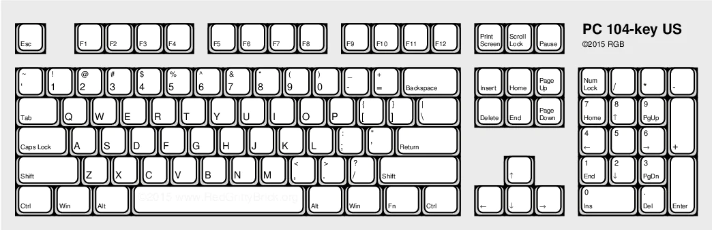

全尺寸键盘，就是大家在量产键盘里见的最多的键盘，以其大而全的形式，非常受办公用户的欢迎，但是渐渐地，大家发现全尺寸的键盘占用的桌面空间实在太多，经常会卡到鼠标，所以各大厂家也开始求变。

#### TKL

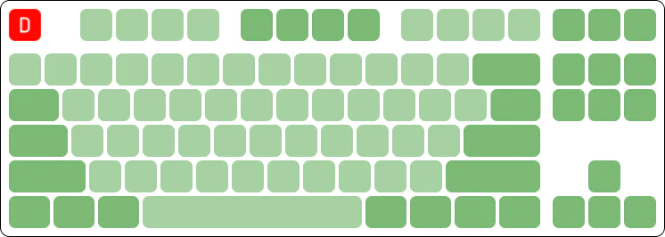

80%配列，也称TKL配列的键盘，就在这种情况下应运而生，它砍掉了小键盘，大概十几个键，所以因此得名TKL->Ten Key Less，这下解放了一大部分右侧空间，但此时大家又说了，那那些很多功能键我也用不上啊，能不能帮我砍砍掉。

#### 75%

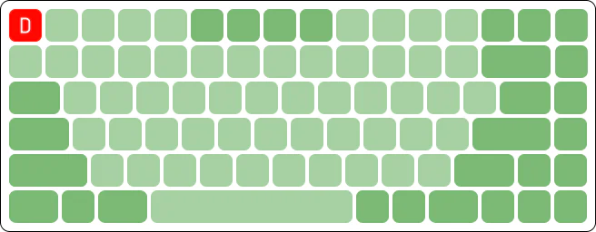

75配列，在TKL配列的基础上，继续精简键位，将一部分常用功能键竖直排列在键盘右侧，缩减部分长键的长度，将方向键也挤了进去，然后对F区也做了保留。我个人认为这样的键盘无论是对于打游戏还是办公，还是对于桌面空间的节省，都在一个比较合适的程度。

#### 6x%

6x%这个配列，对比起上面和下面的配列类别来说，可谓是百花齐放。我个人使用的键盘，也大多都在这个区间内。

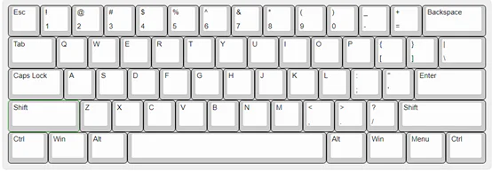

又称poker ，104键位截取60%而来

优点:键帽兼容性高

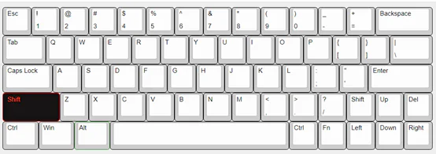

又称左移64，左shift 缩短0.25u，使得第四排整体左移，挤出来1 颗1u Del

缺点：左移了0.25u ，刚开始盲打会有点不习惯。shift已经强调了

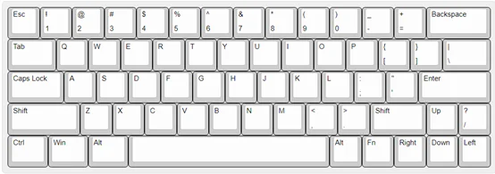

又称非左移64，为了保持上下左右对齐，？放到了右侧，需要习惯

优点：保留 舒服的右shift和方向

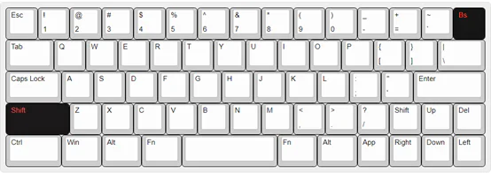

比较出名的就是filco-minila，分裂了退格，但说实话，并不是很好用，3u的空格在中间，哪只手敲都感觉不对。

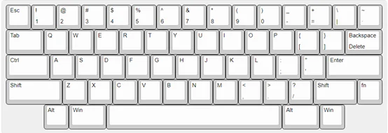

比较有意思的配列，现在网上的固有刻板印象认为是很适合程序员使用的配列，但是……真的适合吗？

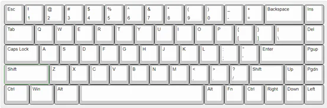

这个配列做到了比较高的兼容性，如果非要选择一个60%配列的键盘的话，我个人会推荐68键，虽然我没用过。

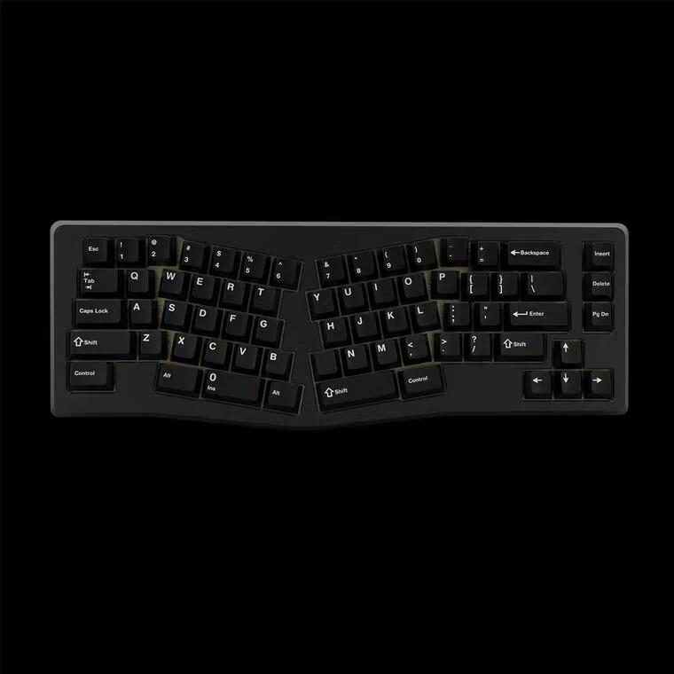

这个是我目前个人最喜欢的配列，手指可以完全自然放置在键盘上，肩部不用绷着，至于是不是真的人体工学？难说，起码我用着是最舒服的。

#### 40%

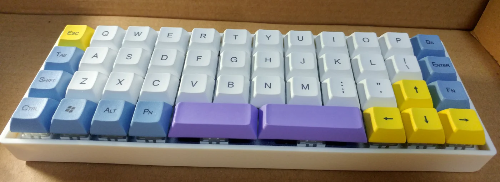

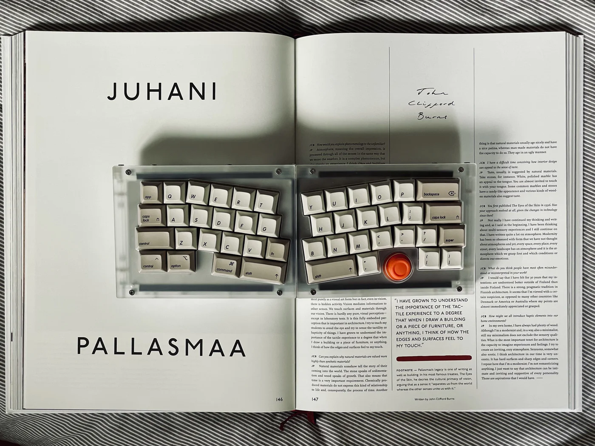

40配列也是我个人一直比较想买的一个配列，但是又怕少了那么多键打字真的不习惯，所以准备之后入手一个便宜的塑料套件尝试一下。

#### pad

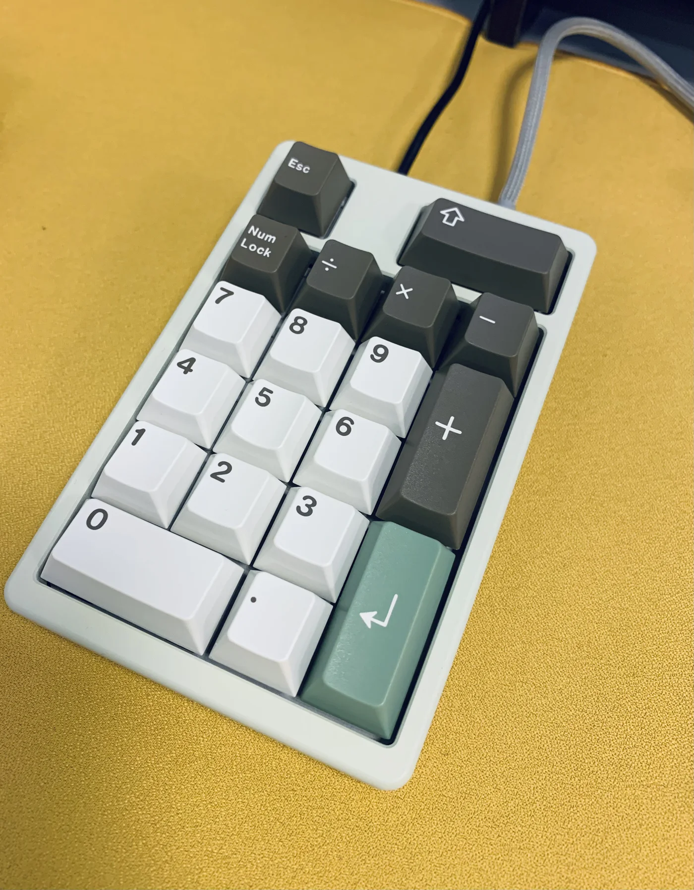

pad这个就不用我多说了，其实就是从104到TKL被砍掉的那一部分，现在很多人会用来设置很多宏，来帮忙简化自己的工作，并将其放置在左手边，不占据右侧空间。

### 结构

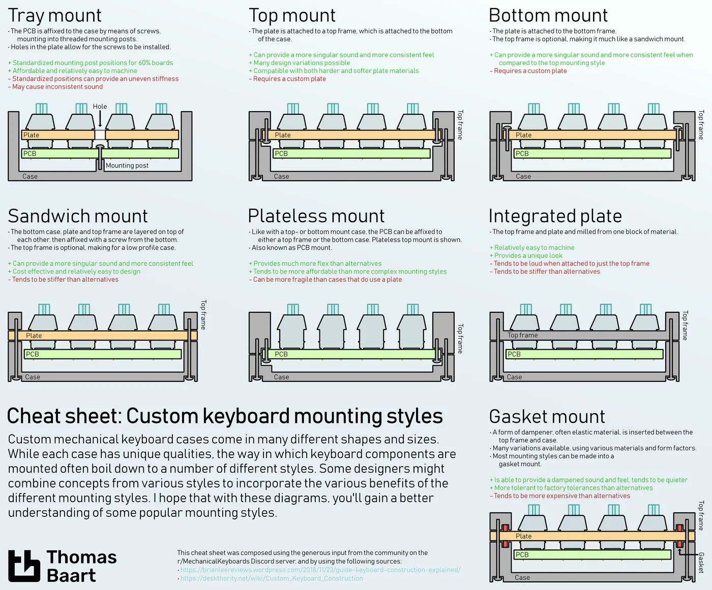

#### Tray mount (托盘结构)

螺丝从定位板正面結合底壳空心部位的螺丝柱及PCB三者。大众向的60%至68% 一般使用这种结构，外壳、PCB及定位板同配列大多能通用。容易设计及制造但螺丝柱会令区域手感软硬不一，并影响打字音统一性。例如：Ducky One 2 Mini系列、Tofu系列、Tada系列、GH60系列、DP-64。

#### Top mount (上壳结构)

直接翻译的话就是上壳式安装，螺丝从定位板背面结合上壳，底壳再结合上壳。能统一手感及打字音，国内及海外大部分高端团购使用这种结构的比例占多。例如：Matrix Lab产品线、Gray Studio产品线、Cannon Keys Savage65、Cannon Keys Satisfaction 75 (还有太多不能尽录)。

#### Bottom mount (底壳结构)

直接翻译的话就是底壳式安装，螺丝从定位板正面结合底壳，底壳再结合上壳。也能较为统一手感及打字音。例如：Percent Studio Canoe Gen1、KBD67v1、KBD8Xv1 (而KBD的v2都改为Top mount了)。

#### Sandwich mount (三明治结构)

想必大家都吃过三明治吧？上壳及底壳是面包，定位板是馅料，而螺丝就是那条牙签了。由于定位板被夹在外壳中间，手感相对较硬，但同时能更好地消除触底的不平衡令打字音更统一。例如：TX Keyboards产品线 (基本上其余做Sandwich Mount 的都加上各种垫片成了Gasket Mount)。

#### Plateless mount (无钢)

不使用定位版，PCB直接跟外壳结合，需要使用五脚轴协助定位。打字手感会较为柔软，打字音也比较安静。例如：除了一体定位板之外你想的都能作无钢，Tray mount 以外的结构要特别定制PCB 增加螺丝孔去作固定。

#### Integrated plate (一体定位板)

定位板跟上壳是一体成型的，相对其他结构打字手感会比较硬，并且容易回馈空腔声，但容易生产。例如：RAMA Koyu、RAMA M60-A、老猫Doro67、Tofu HHKB、Tokyo60。

#### Gasket mount (垫片结构)

时下最火热的结构，一般使用有弹性的物料垫在定位板及外壳的连接处从而达到缓冲震动的效果。使用此结构的键盘手感能达到刚柔并济的效果，打字音清脆利落。

## 杂谈

### 杂谈一之如何通过键盘赚钱

#### 当黄牛

最简单的方式其实就是做黄牛，去倒卖那些知名工作室设计的键盘。比如说我最近购买的Owlab工作室的Spring套件，原价是2250，现在在闲鱼的二手价格已经在2800-2900，稀缺一点的颜色已经到3000的价位。这是一种没有成本的赚钱方法。当然风险还是有的，比如你买了一个不知名工作的垃圾套件，最好的结果就是亏点钱卖出去，最坏的结果就是口碑爆炸，根本不会有人接盘。

如果大家对键圈倒卖有兴趣的话，我提两个国内工作室的名字，Owlab和Matrix工作室，买到就绝对不会亏。

#### 自己做工作室

第二个方式需要有较多的本金投入，那就是自己设计键盘，然后找代工厂，最后去卖套件。当然你可以先收钱，再去生产，将风险完全转嫁用户，但是随着近一年先款团频频出事，键圈用户韭菜觉醒，已经开始渐渐抵制这种行为。所以现在如果你想自己承担的风险低一点的话，那么建议收定金和尾款的形式。最后就是投入本金最多的形式，自己搭钱先生产，最后卖产品赚钱，但是假如你的产品不怎么样，那么就会沦落到和当黄牛差不多的情况，降价或者白送。

#### 算账

给大伙算算在键圈当倒爷和工作室的收入。倒爷遇上比较好的套件，溢价三四百是比较正常的，假如是那种盲盒形式抽奖的，那有时候一把几千也是可以达到的，我算一次倒十把，其实也才几千，何况还有赔钱的风险，但是省在操作少，付钱以及挂闲鱼倒卖即可。这种是比较无脑的。而真正的大头，是工作室。

我给大家算一下工作室的赚钱法子。以下说法来自一个不小心在群里说漏嘴的工作室团长。

一把1599的键盘，成本价可能999都不到，当然这不算己方人工投入。一个情况比较正常的新人团，大概可以卖出去100把，那这里的纯利润就是至少70000，一把键盘在不忙的时候，生产周期大概在两个月到三个月的时间。刨去打样和售后，那纯利润至少在60000左右。这是新人团的收入。而那些卖设计，卖得更贵的，比如2699，3299的利润我不太能想想了。

而那些知名工作室则更加恐怖，照样拿我Spring的工作室Owlab来举例。这次Spring的定价是2250，结构比较特殊，材料则和其他没有区别，那我哪怕算他加工成本极其之高，有1500之巨，那他一把键盘也有700的利润。而他们此次在国内售出的Spring的数量是1000+，也就是说在光在国内，已经有70w的收益了。而他们在海外还有2000的铺货量，而国外，他们收的就是dollar了，利润想必比国内更恐怖，也就是Owlab工作室的人，通过Spring这一把键盘，就获取了200w+的纯利润。我觉得是时候开始学习CAD了。

## 结尾

那今天的键盘分享就到这里，这里只是粗略地给大家过了一下键盘的简要分类，之后更细节的东西，例如什么套件适合上车，什么轴体最适合办公，什么材料的键帽最经久耐用等，有机会我会再给大家作分享。（新建markdown……）
