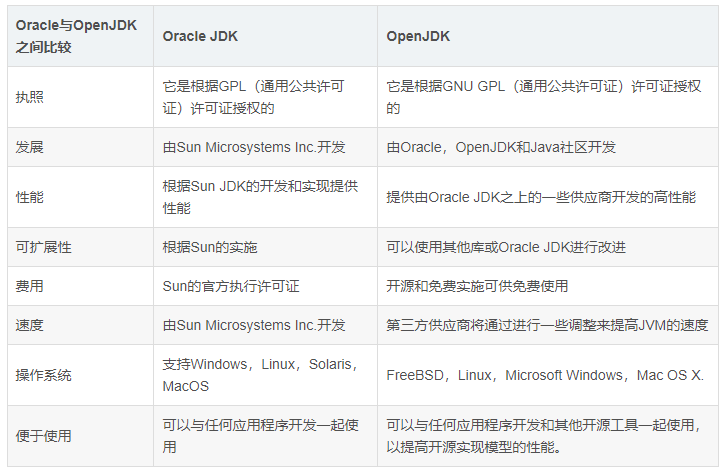

# 什么是 Amber

<!-- vim-markdown-toc GFM -->

- [jdk 是什么，OpenJDK 又是什么](#jdk-是什么openjdk-又是什么)
  - [OracleJDK](#oraclejdk)
  - [OpenJDK](#openjdk)
  - [OpenJDK Community](#openjdk-community)
- [Amber 是什么](#amber-是什么)

<!-- vim-markdown-toc -->

Amber，是目前 OpenJDK 项目组重点关注的几个项目之一（其余的还有如 Valhalla，JMC-OpenJDK Mission Control 等）。

在介绍今天的主角 Amber 之前呢，我想要先介绍一下 OpenJDK。

## jdk 是什么，OpenJDK 又是什么

使用过 linux 的同学应该都会注意到，无所谓哪种发行版，他们自带的包管理工具中安装的 jdk，在执行 java -version 的时候基本上都会是这个样子，无视版本哈。

```bash
openjdk version "17.0.1" 2021-10-19
OpenJDK Runtime Environment (build 17.0.1+12)
OpenJDK 64-Bit Server VM (build 17.0.1+12, mixed mode)
```

那这个 openjdk 和平时我们会说到的 oraclejdk 的区别在哪里呢。

### OracleJDK

OracleJDK，早称 SunJDK，从名字其实也比较容易看出来，最早的 jdk 呢就是 sun 公司开发的，所以叫 SunJDK，当然啊，更早的时候是叫 oak 的。之后 sun 被 oracle 公司收购了（2009），于是 SunJDK 也随之改名叫做 OracleJDK 了。相信呢，大家都是对这个 OracleJDK 还是挺熟悉的。那接下来我就来介绍一下这个 OpenJDK 到底是个什么东西。

### OpenJDK

OpenJDK，故名思意，它是 Java SE 的一种免费开源实现。它是 Sun Microsystems 于 2006 年开始努力的结果。

而在 2007 年，Sun 在 GPL 开源许可证下发布了 Java 类库的完整的源代码（在早前已经开源了 Java HotSpot 虚拟机以及编译器，不过是在 GNU 通用公共许可证下）。在这个时间节点上，OpenJDK 的类库其实还是有 4%的实现是私有的。

时间继续行进到 2008 年 5 月份，OpenJDK6 出现了，此时的类库只有 1%不到的实现是私有的了（SNMP 的实现，好像是一种网络管理协议，是专门设计用于在 IP 网络管理网络节点的一种标准协议，属于应用层协议，它并不是 Java 规范的一部分）。

说起 OpenJDK6 其实还有一个蛮有意思的事情可以分享一下，OpenJDK6 其实是从 JDK7 来的。它基于 JDK7，然后在 JDK7 的基础上，修改删除了 Java7 的新特性，才发行的 Java6 的开源版本。

而 OpenJDK7 则更是一个里程碑式的版本。从这个版本开始，OracleJDK 也是根据 OpenJDK 做出来的。他们会修改一些功能的实现方式，再打上自己的商标，然后提供自己的配套服务。这就意味着，自 Java SE 7 开始往后的所有版本，所有的 JDK，全都源自于 Open JDK。

这里做一个可能不太恰当的比喻。各家的自己的 JDK 和 OpenJDK 的关系其实就像是 Linux 的众多发行版和 Linux 的关系是一样的（当然此处特指 7 开始的版本）。

那么这么重要的一个项目，日常究竟是哪些人在维护与开发呢。

### OpenJDK Community

OpenJDK Community，简单翻译一下，其实就是 OpenJDK 社区，它主要由一些团体以及一组项目构成，当然其中涉及到非常多的其他东西，比如有哪些团体以及角色，项目是如何产生的，大家各自之间是如何协作的等。这些说开了其实就是 OpenJDK Community 的理事会，JCP（Java Community Process），EC（执行委员会，大家所熟知的阿里腾讯华为，就在这个里面），JSR（Java 规范请求）。就是一个 Java 源码的改动，或者一个新的特性，应该如何被提出，然后经由谁审议，最后如何开发等的过程，这个说起来就比较麻烦了，之后如果还有机会可以给大家深入讲一下。

那最后做个总结的话其实就是，就目前大家使用的情况来看，由 OpenJDK Community 领导的 OpenJDK Project 是 Java SE 的官方参考实现。重点是它只产生 OpenJDK 的源码，并不提供可以直接使用的二进制文件。现在大家能使用的二进制文件的 JDK 则是各个组织自己编译之后的产物。OpenJDK 官网指向的二进制文件的下载地址，实际上是 Oracle 的 OpenJDK builds 的下载地址。而 Oracle JDK 则只提供二进制文件，不提供源码，毕竟人家有自己的私有实现。



那接下来我们要介绍的 Loom 以及 Amber 呢，就是我之前提到的 OpenJDK Community 所有的几十个项目中的两个我觉得比较有意思的项目，拿出来和大家分享一下。

## Amber 是什么

Project Amber 呢，官方的说法是，旨在为 JDK 提供一些小的改动，使开发者在开发的过程中更为友好。其实用比较人话来解释这个项目就是，语法糖。

众所周知呢，Java 的代码呢写起来其实是有点啰嗦的。那有没有办法能让大家开发的过程更加快乐一点呢，其实 Amber 就是来做这件事情的。我来举几个 Amber 已经反哺到正式发行版中的小语法糖。

- var

使用 Lombok 的我们应该会知道，Lombok 提供了一个叫做 val 的东西，方便大家写代码

```java

//没有val时我们的代码
List<String> example = new ArrayList<>();

//有了val时我们的代码
val example = new ArrayList<String>();

```

而在这种场景下 var 的功能其实和 Lombok 提供的 val 差不多

```java
var example = new ArrayList<String>();
```

在我们任何想要使用局部变量的地方我们都可以使用 var 这个关键词，只要这个值是明确的。

但是 var 这个词又有一个比较难搞的地方，因为它自身其实并不是 java 的保留字。它其实是一个比较特殊的类型，但是你甚至又能将它用于变量和方法的命名，所以你可以写出以下代码并通过编译：

```java
  public static void main(String[] args) {
    var example = new ArrayList<String>();
    var var = var();
    System.out.println(example);
    System.out.println(var);
    System.out.println(var());
  }

  public static int var(){
    return 1;
  }

```

所以……这玩意儿的使用就见仁见智了，也许可能以后在某个版本的更新中这个东西就可以转正成保留字了。

- instanceof

在做类型转换的时候，我们可能会经常写出下面的这种代码

```java
String content = null;

if (msg instanceof JsonMessage) {

    content = unmarshalJson((JsonMessage) msg);

} else if (msg instanceof XmlMessage) {

    content = unmarshalXml((XmlMessage) msg);

} else if (msg instanceof PlainTextMessage) {

    content = ((PlainTextMessage) msg).getText();

}
```

对于这种强制的类型转换，我们无法避免，但是它既繁琐又不美观。

而在 Amber 项目提供了增强的 instance 功能后，上面的代码我们就可以将其简化成下面这种模式了。

```java
String content = null;

if (msg instanceof JsonMessage json) {

    content = unmarshalJson(json);

} else if (msg instanceof XmlMessage xml) {

    content = unmarshalXml(xml);

} else if (msg instanceof PlainTextMessage text) {

    content = text.getText();

}
```

不得不说既简单又美观。

- 增强的 Switch


不好意思放错了，不是这个 switch，而是这个:

```java
switch (day) {
    case MONDAY:
    case FRIDAY:
    case SUNDAY:
        System.out.println(6);
        break;
    case TUESDAY:
        System.out.println(7);
        break;
    case THURSDAY:
    case SATURDAY:
        System.out.println(8);
        break;
    case WEDNESDAY:
        System.out.println(9);
        break;
}
```

大家也可以看出来，此处有许多重复的无用的 case 关键字，那有了 Amber 的反哺，我们可以拥有什么呢？

```java
switch (day) {
    case MONDAY, FRIDAY, SUNDAY -> System.out.println(6);
    case TUESDAY                -> System.out.println(7);
    case THURSDAY, SATURDAY     -> System.out.println(8);
    case WEDNESDAY              -> System.out.println(9);
}
```

更加直观，更加精炼的 Switch 表达式。

- 文本块

大家回看我们自己项目中写的单元测试，有的时候懒得新建一个 Json 文件，我们会把 json 文本直接写在测试代码中：

```java
String json =
        "{\n" +
            "\"name\": \"FunTester\",\n" +
            "\"age\": 30\n" +
        "}";
```

这个时候它的弊端就显现出来了，我们需要处理很多的转义字符以及换行的问题。

而 Amber 提供的文本块就能解决这个麻烦的问题：

```java
String text = """
        {
            "name": "FunTester",
            "age": "30"
        }
        """;
```

当然这个文本块的功能我个人感觉意义不是很大，它给我的感觉更像是，别的语言有这个功能那我们给 Java 也整一个。因为我们一般比较少会在代码中编写大量的文本，但是它本身自带的规避字符转义的功能可能会在一些意向不到的地方产生作用。

再接下来呢，是我个人感觉比较重磅的一个功能

- 数据类

在传统的写法中，我们的数据类的代码可能是这个样子的：

```java
public class MyRecord {
    private final String username;
    private final Integer age;

    public MyRecord(String username, Integer age) {
        this.username = username;
        this.age = age;
    }

    public String username() {
        return username;
    }

    public Integer age() {
        return age;
    }

    @Override
    public boolean equals(Object o) {
        if (this == o) return true;
        if (o == null || getClass() != o.getClass()) return false;
        MyRecord oldRecord = (MyRecord) o;
        return Objects.equals(username, oldRecord.username)
                && Objects.equals(age, oldRecord.age);
    }

    @Override
    public int hashCode() {
        return Objects.hash(username, age);
    }

    @Override
    public String toString() {
        return "MyRecord[" +
                "username='" + username + '\'' +
                ", age=" + age +
                ']';
    }
}
```

它包含了两个 final 的属性，因为作为数据类我们一般认为他的属性是不可变化的。然后有一些他们的 getter，以及常用的 Object 方法的重写。他看起来是否也是非常的繁琐，所以才会有了 Lombok 的诞生不是吗？那么在 Amber 项目的加持下，这样的数据类我们可以怎样定义呢，请看：

```java
public record MyRecord(String username,Integer age) {
}
```

that's it，这样就可以了。

不过需要注意的是，所有使用 record 关键字声明的 Record 类，都是 Record 这个类的子类，这有点类似于 enum 的概念。所以从这个角度上来说，所有的数据类都会有一个隐式的父类 Record，这就导致了他们无法使用 extends 关键字再去继承其他的类。

还有一个需要注意的点就是，Record 类的成员变量只能通过构造去声明：

```java
public record MyRecord(String username,Integer age) {
privite String gender;
}
```

这种写法就是错误的。

以上我提到的这些 Amber 项目的小功能其实都已经合并进入了主代码中，起码我在最新的 jdk17 上是可以完美使用这些新功能的。

当然还有类似密封类型这种功能我这里也就不再具体展示了，它的功能就是限制一个父类只能由哪些类继承，更好地去保证安全性吧。

而还有一些正在开发中的，或者停摆的一些功能，我在这边就简单地介绍一下，大家如果有兴趣的话，也可以自己之后再去找资料。

- JEP 301 增强枚举（停摆）

  好像是想对枚举提供泛型的功能，从官方的代码上来看还有对每个枚举项的类型定义：

  ```java
  enum Primitive {
    BYTE(Byte.class, 0),
    SHORT(Short.class, 0),
    INT(Integer.class, 0),
    FLOAT(Float.class, 0f),
    LONG(Long.class, 0L),
    DOUBLE(Double.class, 0d),
    CHAR(Character.class, 0),
    BOOLEAN(Boolean.class, false);

    final Class<?> boxClass;
    final Object defaultValue;

    Primitive(Class<?> boxClass, Object defaultValue) {
       this.boxClass = boxClass;
       this.defaultValue = defaultValue;
    }

  enum Argument<X> { // declares generic enum
   STRING<String>(String.class),
   INTEGER<Integer>(Integer.class), ... ;

   Class<X> clazz;
   Argument(Class<X> clazz) { this.clazz = clazz; }

   Class<X> getClazz() { return clazz; }
  }

  Class<String> cs = Argument.STRING.getClazz(); //uses sharper typing of enum constant

  ```

  但是考虑到和现有 jvm 的兼容性以及代码的安全性考虑，这个 feature 目前几乎是处于被放弃的状态。

- JEP 302 Lambda LeftOver（待定）

  主要目的是通过增强方法上下文中函数表达式的消除歧义，完成下划线字符的功能，以及允许 lambda 参数在封闭作用域中隐藏变量，提高 lambda 和方法引用的可用性。

  这个项目目前的状态还是待定，我个人感觉还是很有搞头的。

  这里我就直接贴一下官方的文档[JEP 302](https://openjdk.java.net/jeps/302)。

- JEP 420 Pattern Matching for switch (Second Preview) （开发中）

  目标 jdk18 发布的一个新功能，目标就是在之前我提到的那个增强模式匹配以及增强的 switch 的基础上进行再增强，但是官方的字太多了我还没来得及看。这里我也暂时贴一下文档，之后有时间我会再进行补全。

  [JEP 420](https://openjdk.java.net/jeps/420)

那么今天的分享就到此结束，感谢大家的关注，谢谢！
