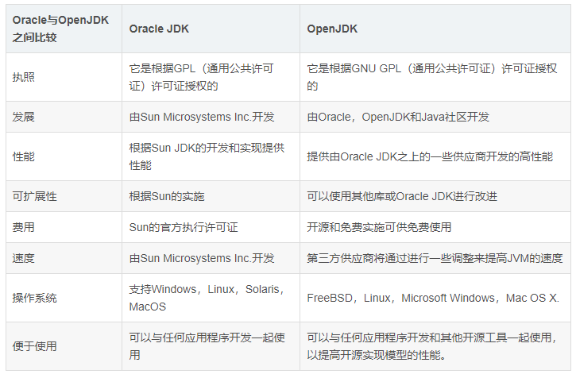

# 什么是Loom和Amber


<!-- vim-markdown-toc GFM -->

* [jdk是什么，OpenJDK又是什么](#jdk是什么openjdk又是什么)
  * [OracleJDK](#oraclejdk)
  * [OpenJDK](#openjdk)
  * [OpenJDK Community](#openjdk-community)
* [amber是什么](#amber是什么)
* [loom又是什么](#loom又是什么)

<!-- vim-markdown-toc -->

Loom和Amber，是目前OpenJDK项目组重点关注的几个项目之一（其余的还有如Valhalla，JMC-OpenJDK Mission Control等）。

在介绍今天的主角Loom和Amber之前呢，我想要先介绍一下OpenJDK。

## jdk是什么，OpenJDK又是什么

使用过linux的同学应该都会注意到，无所谓哪种发行版，他们自带的包管理工具中安装的jdk，在执行java -version的时候基本上都会是这个样子，无视版本哈。

```bash
openjdk version "17.0.1" 2021-10-19
OpenJDK Runtime Environment (build 17.0.1+12)
OpenJDK 64-Bit Server VM (build 17.0.1+12, mixed mode)
```

那这个openjdk和平时我们会说到的oraclejdk的区别在哪里呢。

### OracleJDK

OracleJDK，早称SunJDK，从名字其实也比较容易看出来，最早的jdk呢就是sun公司开发的，所以叫SunJDK，当然啊，更早的时候是叫oak的。之后sun被oracle公司收购了（2009），于是SunJDK也随之改名叫做OracleJDK了。相信呢，大家都是对这个OracleJDK还是挺熟悉的。那接下来我就来介绍一下这个OpenJDK到底是个什么东西。

### OpenJDK

OpenJDK，故名思意，它是Java SE的一种免费开源实现。它是Sun Microsystems于2006年开始努力的结果。

而在2007年，Sun在GPL开源许可证下发布了Java类库的完整的源代码（在早前已经开源了Java HotSpot虚拟机以及编译器，不过是在GNU通用公共许可证下）。在这个时间节点上，OpenJDK的类库其实还是有4%的实现是私有的。

时间继续行进到2008年5月份，OpenJDK6出现了，此时的类库只有1%不到的实现是私有的了（SNMP的实现，好像是一种网络管理协议，是专门设计用于在IP网络管理网络节点的一种标准协议，属于应用层协议，它并不是Java规范的一部分）。

说起OpenJDK6其实还有一个蛮有意思的事情可以分享一下，OpenJDK6其实是从JDK7来的。它基于JDK7，然后在JDK7的基础上，修改删除了Java7的新特性，才发行的Java6的开源版本。

而OpenJDK7则更是一个里程碑式的版本。从这个版本开始，OracleJDK也是根据OpenJDK做出来的。他们会修改一些功能的实现方式，再打上自己的商标，然后提供自己的配套服务。这就意味着，自Java SE 7开始往后的所有版本，所有的JDK，全都源自于Open JDK。

这里做一个可能不太恰当的比喻。各家的自己的JDK和OpenJDK的关系其实就像是Linux的众多发行版和Linux的关系是一样的（当然此处特指7开始的版本）。

那么这么重要的一个项目，日常究竟是哪些人在维护与开发呢。

### OpenJDK Community

OpenJDK Community，简单翻译一下，其实就是OpenJDK社区，它主要由一些团体以及一组项目构成，当然其中涉及到非常多的其他东西，比如有哪些团体以及角色，项目是如何产生的，大家各自之间是如何协作的等。这些说开了其实就是OpenJDK Community的理事会，JCP（Java Community Process），EC（执行委员会，大家所熟知的阿里腾讯华为，就在这个里面），JSR（Java规范请求）。就是一个Java源码的改动，或者一个新的特性，应该如何被提出，然后经由谁审议，最后如何开发等的过程，这个说起来就比较麻烦了，之后如果还有机会可以给大家深入讲一下。

那最后做个总结的话其实就是，就目前大家使用的情况来看，由OpenJDK Community领导的OpenJDK Project是Java SE的官方参考实现。重点是它只产生OpenJDK的源码，并不提供可以直接使用的二进制文件。现在大家能使用的二进制文件的JDK则是各个组织自己编译之后的产物。OpenJDK官网指向的二进制文件的下载地址，实际上是Oracle的OpenJDK builds的下载地址。而Oracle JDK则只提供二进制文件，不提供源码，毕竟人家有自己的私有实现。



那接下来我们要介绍的Loom以及Amber呢，就是我之前提到的OpenJDK Community所有的几十个项目中的两个我觉得比较有意思的项目，拿出来和大家分享一下。

## Amber是什么

Project Amber呢，官方的说法是，旨在为JDK提供一些小的改动，使开发者在开发的过程中更为友好。其实用比较人话来解释这个项目就是，语法糖。

众所周知呢，Java的代码呢写起来其实是有点啰嗦的。那有没有办法能让大家开发的过程更加快乐一点呢，其实Amber就是来做这件事情的。我来举几个Amber已经反哺到正式发行版中的小语法糖。

+ var

使用Lombok的我们应该会知道，Lombok提供了一个叫做val的东西，方便大家写代码

``` java

//没有val时我们的代码
List<String> example = new ArrayList<>();

//有了val时我们的代码
val example = new ArrayList<String>();

```
而在这种场景下var的功能其实和Lombok提供的val差不多

```java
var example = new ArrayList<String>();
```

在我们任何想要使用局部变量的地方我们都可以使用var这个关键词，只要这个值是明确的。

但是var这个词又有一个比较难搞的地方，因为它自身其实并不是java的保留字。它其实是一个比较特殊的类型，但是你甚至又能将它用于变量和方法的命名，所以你可以写出以下代码并通过编译：

``` java
  public static void main(String[] args) {
    var example = new ArrayList<String>();
    var var = var();
    System.out.println(example);
    System.out.println(var);
    System.out.println(var());
  }

  public static int var(){
    return 1;
  }

```

## Loom又是什么
